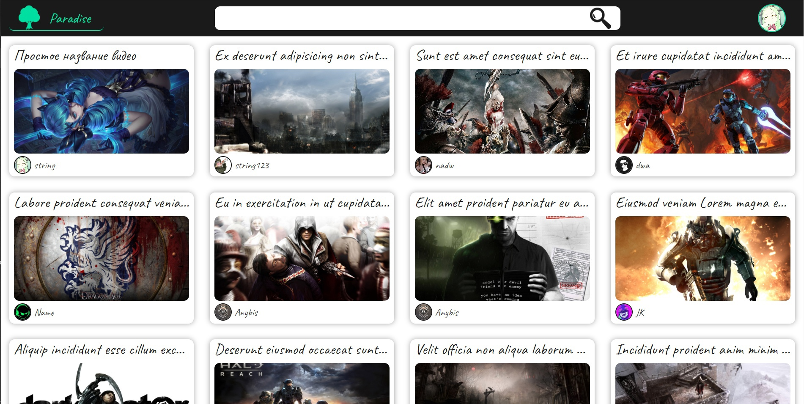
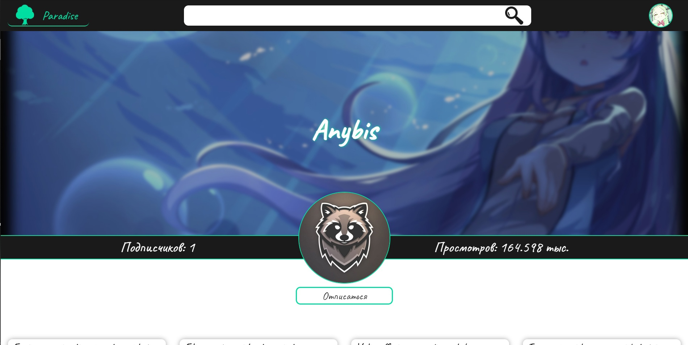
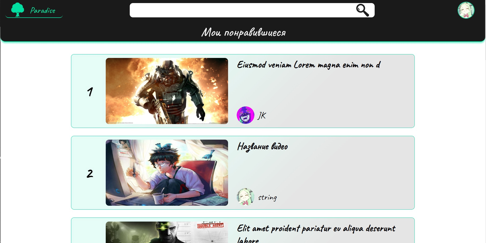
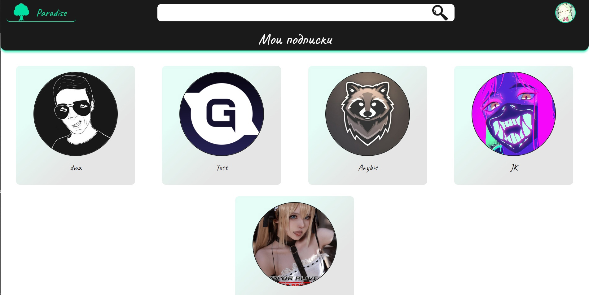
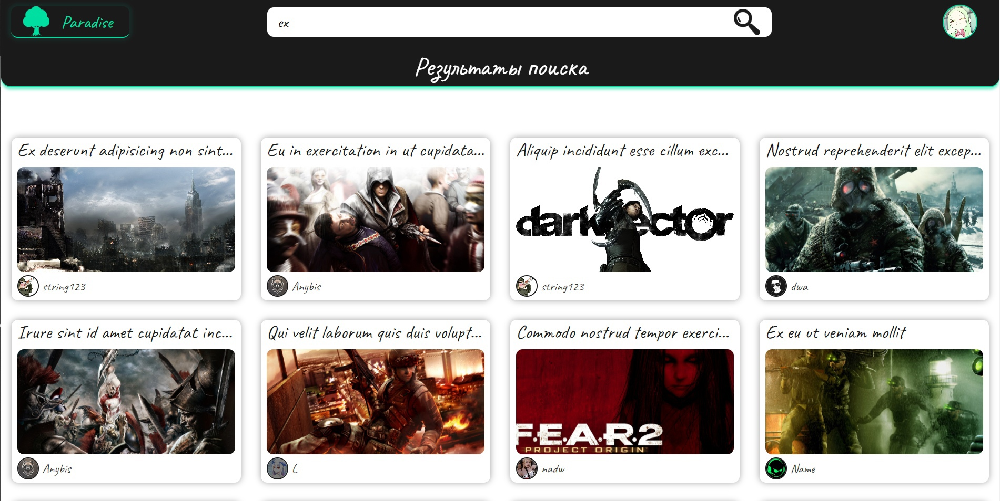

# Paradise api

## Version:

> 1.0 

## Description: 

> Paradise is a video hosting service that provides users with video storage, delivery and display services

> This project has an open Api, on the basis of which anyone can make their own mobile, desktop, web application.

## Screenshot

  
  
  
  
  

## Stack technology

> #### Backend
>> Asp.Net core 6 (Rest Api)

> #### Frontend
>> React.js

> #### Data Base
>> MS Sql Server for main data
>> 
>> SQLite for logging

### Task list 

> [first list task](Tasks/Task1.md)

- [x] Update UI for Paradie front
- [x] Unit test coverage of ~50% of controllers
> ### Frozen
> - [ ] Create Admin Panel (Asp.net MVC)
> - [ ] Admin Panel: Auth
> - [ ] Admin Panel: block video and user
> - [ ] Admin Panel: create new admin and moderator

## Licence

> Permission is hereby granted, free of charge, to any person obtaining a copy of this software and associated documentation files (the "Software"), to deal in the Software without restriction, including without limitation the rights to use, copy, modify, merge, publish, distribute, sublicense, and/or sell copies of the Software, and to permit persons to whom the Software is furnished to do so, subject to the following conditions: The above copyright notice and this permission notice shall be included in all copies or substantial portions of the Software. THE SOFTWARE IS PROVIDED "AS IS", WITHOUT WARRANTY OF ANY KIND, EXPRESS OR IMPLIED, INCLUDING BUT NOT LIMITED TO THE WARRANTIES OF MERCHANTABILITY, FITNESS FOR A PARTICULAR PURPOSE AND NONINFRINGEMENT. IN NO EVENT SHALL THE AUTHORS OR COPYRIGHT HOLDERS BE LIABLE FOR ANY CLAIM, DAMAGES OR OTHER LIABILITY, WHETHER IN AN ACTION OF CONTRACT, TORT OR OTHERWISE, ARISING FROM, OUT OF OR IN CONNECTION WITH THE SOFTWARE OR THE USE OR OTHER DEALINGS IN THE SOFTWARE.
